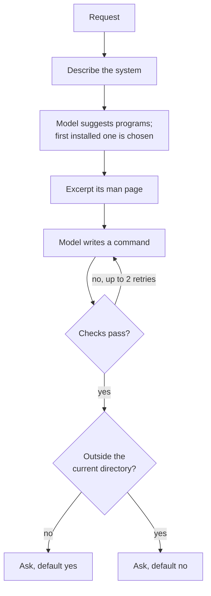

# How it works

thetaterm is built for small models that run on a laptop. Those models know
roughly what `find` or `sed` does, but they mix up the options that differ
between GNU, BSD and BusyBox tools. A command that works on Linux can fail or
do something else on a Mac. thetaterm doesn't expect the model to remember
those differences. It gives the model your own system's documentation, then
checks the answer.

## From request to command

**Describe the system.** At start-up thetaterm builds one line, such as
`macOS 26.6.2, BSD userland, zsh shell`. It reads the OS name, decides the
userland by checking whether `ls` is BusyBox or reports GNU, and takes the shell
as described [below](#which-shell). Every prompt starts with this line.

**Choose the program.** The model is asked which programs could do the task, up
to five, best first. thetaterm takes the first one that's actually installed.
The model is good at naming tools. What it's bad at is their options on your
particular system.

**Excerpt the man page.** thetaterm reads the chosen program's `man` page and
splits it into paragraphs and option entries. It keeps the NAME and SYNOPSIS,
then the entries that share the most words with your request, with rare words
counting more than common ones. It stops at 3,500 characters, so a small
model's context isn't flooded. If there's no man page, the model gets no
reference. thetaterm never runs a program to read its docs, such as with
`--help`, because not every program honours that flag
([ADR 0005](../adr/0005-never-run-a-program-to-read-its-docs.md)).

**Write the command.** The model gets the system line, the excerpt and your
request, and is told to answer with one command, using real paths rather than
placeholders, and the current directory when you didn't name one. thetaterm
strips anything the model wraps around the command, such as code fences, a
`$ ` prompt or a `Command:` label.

**Check it.** The command must be valid syntax for your shell (`<shell> -n`), and each
program it calls must be installed. If it fails, the model is shown the error
and asked again, up to three attempts in total. The checks catch commands that
can't work. They don't judge whether a command is a good idea. See
[Safety model](safety.md).

**Ask you.** You see the command. If it reaches outside the current directory,
it's shown in red with the reason, and the default answer is no.

## With `--think`

With reasoning on, the model works out the options itself, so `--think` skips
choosing a program and excerpting its man page, and makes one model call. When
this was added, `gemma4:e4b` passed 49 of 50 evals this way, against 48 of 50
without `--think`, but took about twice as long. The checks and confirmation
still apply.

Without `--think`, thetaterm asks the server to turn reasoning off, because a
reasoning model can spend minutes over a man page to write one line. If the
server rejects that setting, thetaterm drops it and retries.

## The model server

thetaterm talks to any server with the OpenAI-compatible `/chat/completions`
endpoint, at temperature 0, so the same request tends to give the same command.
It uses Python's standard library for this and has no provider SDK. See
[ADR 0004](../adr/0004-openai-compatible-api-over-stdlib-http.md).

## Which shell

thetaterm writes commands for your login shell, `$SHELL`, and runs them with it,
so the command you see works the same way if you paste it into your own
terminal. That's used when the shell is `sh`, `bash`, `zsh`, `ksh` or `dash`.

Other shells, such as `fish`, `nu` or `tcsh`, have their own syntax, and
thetaterm's checks read commands as `sh`-style words. For those it uses `bash`
if it's installed, otherwise `/bin/sh`. The system description shows which shell
was picked.

Commands run non-interactively, so your aliases and shell functions aren't
available to them.
